# hx Screenshots

#### Apache logs

[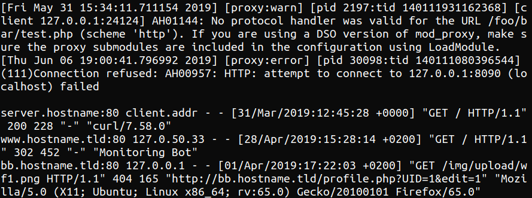](img/apache0.png)
[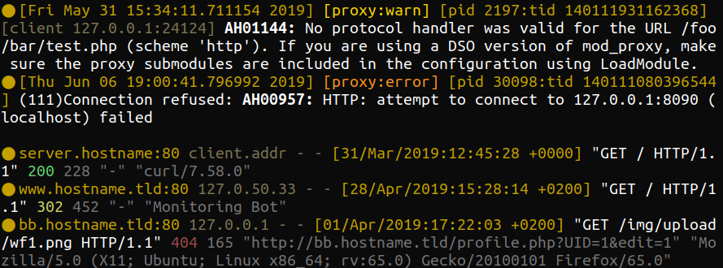](img/apache1.png)

#### Syslog

[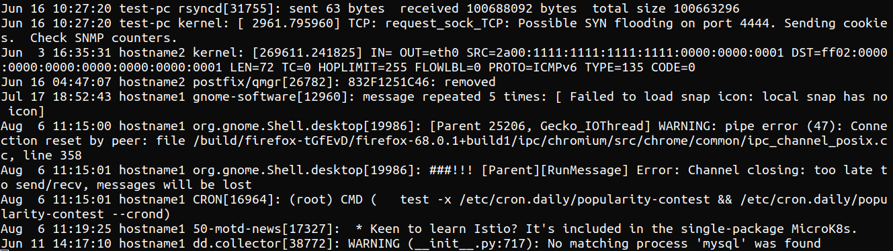](img/syslog0.png)
[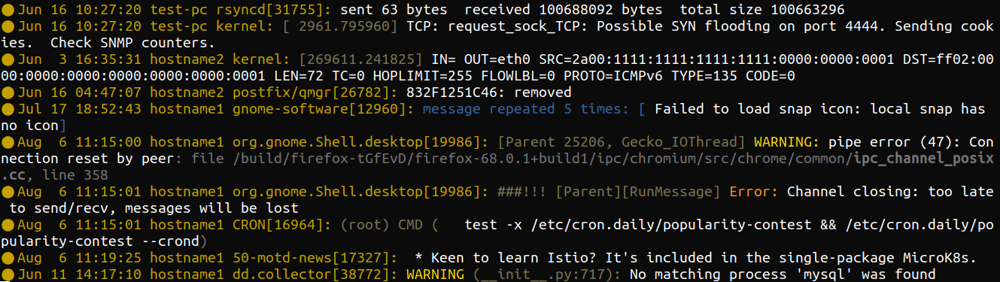](img/syslog1.png)

#### `tail -f` on Multiple Files

[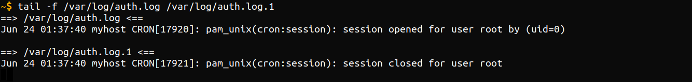](img/tailf0.png)
[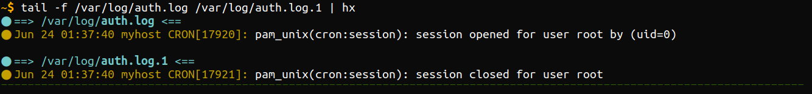](img/tailf1.png)

#### nginx Error Log

[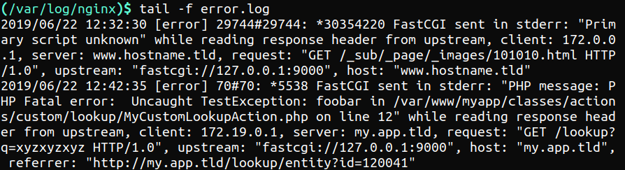](img/nginx0.png)
[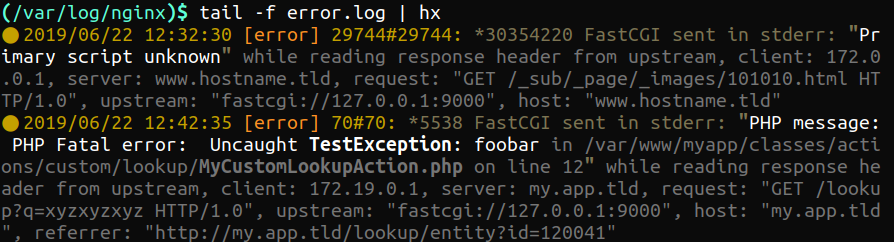](img/nginx1.png)

#### Postfix Errors

[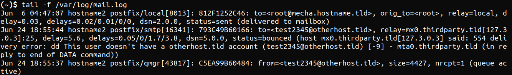](img/postfix0.png)

[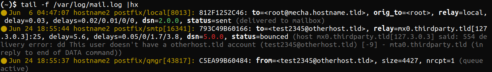](img/postfix1.png)

#### SSH

[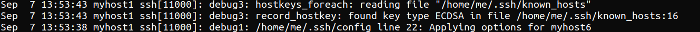](img/ssh0.png)

[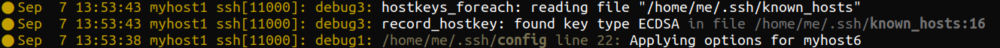](img/ssh1.png)

